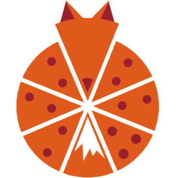
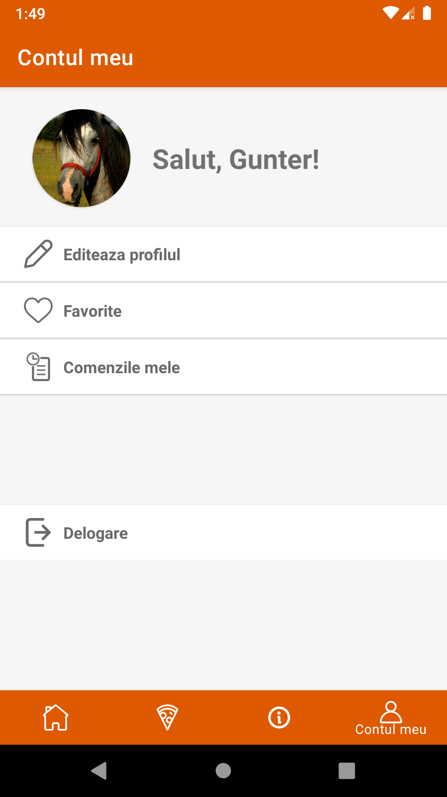

    
    <h1>PizzaHunter</h1>

PizzaHunter is a simple Android app, made to learn the basics of Android development using Kotlin.

PizzaHunter is a WIP food delivery app, where you can place orders and share items in the restaurant's menu with your friends.

## Technologies

-   [Kotlin](https://kotlinlang.org/)
-   [Firebase](https://firebase.google.com/docs) (Firestore, Storage and Auth)
-   [Facebook for developers](https://developers.facebook.com/)
-   [Google Services](https://developers.google.com/identity/sign-in/android/sign-in)
-   [Retrofit](https://square.github.io/retrofit/)
-   [Material.io](https://material.io/)
-   [Picasso](https://square.github.io/picasso/)
-   [Custom Food API](https://gunter-food-api.herokuapp.com/)

## Features

### ✔️ Authentication

-   simple authentication using email and password
-   social login using Facebook and Google

### ✔️ Data persistence using database

-   Firebase (user information & profile pictures)
-   user can edit the profile information

### ✔️ Camera - taking a photo

-   using [CameraX](https://developer.android.com/training/camerax) to take a photo
-   saving the image to the gallery
-   uploading the image to the Firebase Storage
-   user can also load a picture from the gallery as profile picture

### ✔️ Bottom Tab Navigation

-   [Material.io bottom navigation](https://material.io/components/bottom-navigation)

### ✔️ Dynamic lists with search option

-   RecyclerView for the food list in the menu
-   search option, to filter or find specific items

### ✔️ Android Sharesheet

-   sharing basic information about a particular item in the menu
-   it can be shared using any available application on the device

### ✔️ Web services

-   custom food API

    -   [Food API hosted on Heroku](https://gunter-food-api.herokuapp.com/)
    -   [Github repo](https://github.com/DianaVasiliu/Food-API)

-   fetching the API using Retrofit
-   using the data in the RecyclerView

### ✔️ Video playback

-   play a presentation video in the home page
-   user can pause and unpause the video

### ✔️ UI for landscape mode

## Screenshots

### Menu

    
    

### Social Login

    
    

### Edit profile information

    
    
    

### Edit profile picture

1. Take photo using camera

    
    
    

2. Upload picture from gallery

    
    

### Sharesheet

    
    
    

### Video playback

    
    

## TODO

See [TODO list](TODO.md) for more features that should be added in this app.
